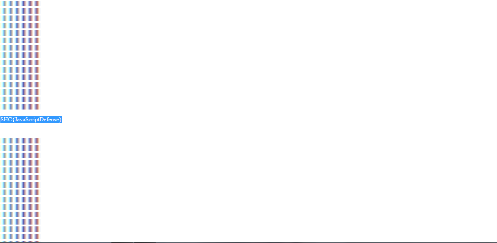

------------------------------------
[Iniciando na C.I.A] - WEB 30 Pontos
------------------------------------

> Faz algum tempo que Edward Snowden vazou documentos sigilosos, desde então começamos a verificar sistemas vulneráveis! você assume agora o cargo de Analista de segurança segue o link para o primeiro serviço! Nessa primeira etapa irá reportar a John Brennan diretamenta!

> wwww.cybercommand.gov

Essa tarefa teria que entrar no painel do cybercommand.gov,logo iniciando o inspecionar elemento poderia ver seis scripts javascript cada um tem um username e password,O ultimo era o certo!,logando no painel descendo lá pro final teria uma parte em branco que não estava com "||||||||||||||||||||||||||||||||||"
Selecionando essa parte estaria a flag!
SHC{JavaScriptDefense}

Heaven -- BigBangTeam
