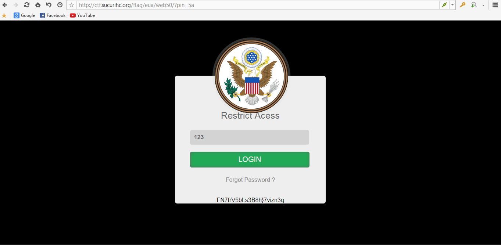
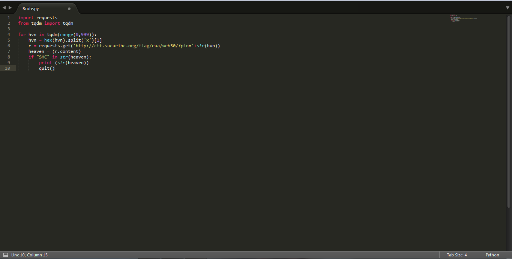
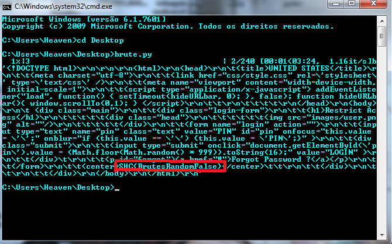

------------------------------------
[Restrict acess] - WEB 50 Pontos
------------------------------------

> Aqui na agência os novatos se deparam com sistemas antigos com pouca ou quase nenhuma documentação! Esse sistema da acesso ao acervo de operações da Segunda Guerra Mundial! Cada PIN digitado gera uma contra-senha! apenas a flag é a correta!

> admin.secondwar.gov

Essa tarefa teria que entrar no painel do admin.secondwar.gov usando um PIN,se você colocasse qualquer pin ele retornava na url o pin em Hexadecimal ou seja era via GET!.

Um PIN geralmente é composto por 3 digitos,Fiz um brute force em python via GET em Hexadecimal que ia de 0 a 999.

Esse script quando achar o PIN ele retornava a source da pagina e lá embaixo estaria a Flag! o PIN era 761
SHC{BrutesRandomFalse}

Heaven -- BigBangTeam
